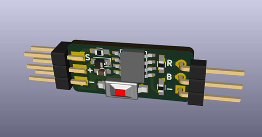
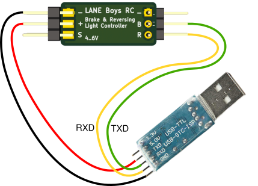
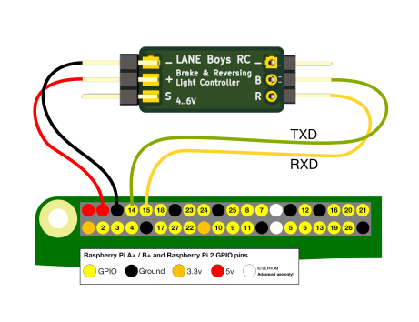

# RC Brake & Reversing Light controller

This project is an easy-to-build light controller for Radio Controlled cars that simulates realistic brake and reversing lights.

It hooks between your ESC and receiver.

The brake lights automatically turn on for a short, random time when the throttle goes to neutral. The reversing lights turn on when driving backwards.

The light controller supports various ESC modes to ensure the lights are in sync with the way your ESC controls the drive motor.

The aim of the project is to make it easy to build anyone with minimal electronics knowledge. **If you are unable to build it yourself please contact [laneboysrc@gmail.com](mailto:laneboysrc@gmail.com); we'd be happy to sell you one.**

If you are looking for more than just brake lights check out our full-featured [DIY RC Light Controller](https://github.com/laneboysrc/rc-light-controller).

## Building the electronics

The core of the light controller is the inexpensive STC STC15W104. It is a modern interpretation of the venerable 8051 MCU. This MCU was chosen due to its very low cost and because it can be programmed with an inexpensive USB-to-serial adapter, or using the serial port on a Raspberry Pi.

You can find the STC15W104 usually on eBay, AliExpress, Electrodragon, LCSC ...

Beside the MCU you need 3 resistors, a diode and a capacitor. The complete [list of components](electronics/BOM%20-%20Bill%20of%20Materials.txt) can be found in the `electronics/` folder

For convenience the [schematics are available as PDF file](electronics/rc-brake-lights-schematics.pdf).

Due to the small number of required components, the light controller can be easily built on a perfboard. The following image shows how to wire everything up:

(The [Fritzing](http://fritzing.org) source file for this drawing is provided in the `fritzing/` folder)

If you plan to build several controllers it may be worth-while to order printed circuit boards. [Gerber files](gerber-rc-brake-lights.zip) for manufacturing PCBS are provided, as well as the [KiCad source files](electronics/). Note that the PCB uses SMD components rather than through-hole. Still, it is designed for hand-soldering.

## Loading the firmware

You can find the pre-compiled firmware released as part of the project.

If you want to build or modify the firmware you will need [SDCC](http://sdcc.sourceforge.net) and [GNU Make](https://www.gnu.org/software/make/).

To flash the firmware into the STC15W104, use [STCGAL](https://github.com/grigorig/stcgal).

### Loading the firmware with an USB-to-serial adapter

Follow the instructions at [https://github.com/grigorig/stcgal#installation](https://github.com/grigorig/stcgal#installation) to install STCGAL. This programming tool for the STC MCU requires [Python 3](https://www.python.org/downloads/), and the Python 3 libraries `pyserial` and `tqdm`.

- Go to https://www.python.org and download Python; install it.
- Open a Command prompt (run cmd.exe)
- In the command prompt execute `pip install pyserial tqdm`

Connect your USB-to-serial adapter to the RC-brake-lights controller as follows:

Do not connect `+` yet, only after starting STCGAL.

Download the [firmware Intel-HEX file](rc-brake-lights.ihx) and execute STCGAL as follows:

    python stcgal.py -t 12000 --option low_voltage_reset=true --option low_voltage_threshold=0 --option eeprom_lvd_inhibit=true -b 1200 rc-brake-lights.ihx

Once started, STCGAL prompts you to power-cycle the circuit. Plug in `+` and STCGAL should find the MCU and program it. Your controller is now ready to use.

### Loading the firmware using a Raspberry Pi

The Raspberry Pi has a serial port accessible on its GPIO pin-header, so we can use it directly for programming.

Connect the RC-brake-lights controller as follows:

Do not connect `+` yet, only after starting STCGAL.

Download and unpack STCGAL:

    wget https://github.com/grigorig/stcgal/archive/master.zip
    unzip master.zip

Install the required Python 3 modules:

    sudo apt install python3-serial python3-tqdm

Use `sudo raspi-config` and go to `Interface Options`, then `P6 Serial` where you can disable log-in via the serial console, and enable the serial hardware:

    Would you like a login shell to be accessible over serial? Select NO
    Would you like the serial port hardware to be enabled? Select YES

After rebooting, download the [firmware Intel-HEX file](rc-brake-lights.ihx) and execute STCGAL as follows:

    python3 stcgal-master/stcgal.py -p /dev/ttyAMA0 -t 12000 --option low_voltage_reset=true --option low_voltage_threshold=0 --option eeprom_lvd_inhibit=true -b 1200 rc-brake-lights.ihx

Once started, STCGAL prompts you to power-cycle the MCU. Plug in `+` and STCGAL should find the MCU and program it. Your controller is now ready to use.

## Connecting the light controller to your RC system

The light controller has two parallel connectors on the input side. Connect your ESC to one of the plugs and connect the TH input of the receiver with a male-to-male servo cable  to the other plug.

The `B` output drives two red LEDs in parallel for the brake light function, the `R` output drives two white LEDs in parallel for the reversing light function.

## Forward/Reverse setup

Depending on your RC system, out of the box the light controller may operate in the wrong direction (forward and backward reversed). To change this, press and hold the setup button on the light controller for 3 seconds. The LEDs will start flashing quickly.

Now move the throttle on the transmitter to the driving direction that would make the car move `forward`. When LEDs will go out and the light controller has now learned the correct direction of the throttle signal for `forward`. This setting is preserved, so you only have to do this once.

## Changing the ESC mode

When it comes to brake function, ESC models behave differently. The light controller can be programmed for the specific behavior of your ESC.

To change the ESC mode, perform the following steps:
Press and hold the setup button on the light controller. After 3 seconds, the LEDs will start to flash quickly. Press the setup button one more time. The light controller enters the ESC mode setting and flashes the current ESC mode number:

##### 1 flash: Forward/Brake/Reverse with timeout
When driving forward and then immediately pushing the throttle to reverse, the ESC performs a brake function. The ESC only allows driving backwards if the ESC has remained in neutral position for a few seconds.

Example: The China 320A ESC, HPI SC-15WP

##### 2 flashes: Forward/Brake/Reverse
After going forward and then into reverse, the ESC always performs the brake function -- even if the throttle remained in neutral for a long time.

Example: Tamiya ESCs

##### 3 flashes: Forward/Reverse (Crawler mode)
Crawler ESC with drag brake, where the ESC switches from forward directly
into reverse.

##### 4 flashes: Forward/Brake
ESC in race mode where reversing is not allowed.

Press the setup button repeatedly until the desired ESC mode has been selected. Then press-and hold the setup button until the LEDs stop flashing. The ESC mode has now been persistently stored.

